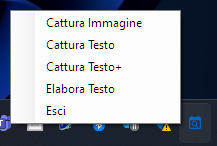
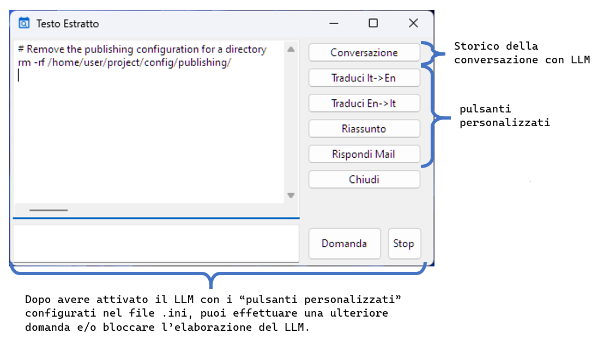

# AICapture
===========

AICapture è un programma che si installa nella barra delle applicazioni di Windows e offre diverse funzionalità utili per la cattura e l'elaborazione di immagini e testi. E' prevista un'ulteriore rifinitura del testo estratto, mediante l'uso di LLM locale in formato GGUF scaricabile su [Hugging Face](https://huggingface.co/).

## Funzionalità

- **Cattura Immagine**: Permette di catturare un'area dello schermo e copiare l'immagine negli appunti.
- **Cattura Testo**: Utilizza OCR (Optical Character Recognition) per estrarre testo da un'area dello schermo e copiarlo negli appunti.
- **Cattura Testo+**: Concatena il testo catturato con il testo già presente negli appunti.
- **Elabora Testo**: Consente di rielaborare il testo catturato utilizzando un modello di linguaggio (LLM) in formato GGUF.




## Configurazione

È possibile aggiungere pulsanti personalizzati nella finestra di elaborazione configurando il file di inizializzazione. Ogni pulsante può eseguire un prompt specifico tramite l'AI.




## Librerie utilizzate

- **LLama.Common**: Utilizzato per l'integrazione con il modello di linguaggio. [Documentazione](https://scisharp.github.io/LLamaSharp/0.5/GetStarted/)
- **LLama**: Libreria principale per l'esecuzione del modello di linguaggio. [Documentazione](https://scisharp.github.io/LLamaSharp/0.5/GetStarted/)
- **Tesseract**: Utilizzato per l'OCR e l'estrazione del testo dalle immagini. [Documentazione](https://github.com/tesseract-ocr/tesseract)


## Installazione

1. Scaricare e installare AICapture.
2. Scaricare su [Hugging Face](https://huggingface.co/) il modello LLM scelto, in formato GGUF.
3. Configurare il file di inizializzazione per aggiungere eventuali pulsanti personalizzati ed il link al file GGUF.
4. Avviare il programma, che si posizionerà nella barra delle applicazioni.

Per utilizzare il programma, è necessario configurare le seguenti variabili nel file CTXdesktop.ini:

*   `#LLM_modelPath`: C:\\< percorso modello GGUF >\\< nome modello GGUF >.gguf
*   `#LLM_appPrompt1`: < nome pulsante1 >|< prompt pulsante (SYSTEM) >|< testo assistente (ASSISTANT) >
*   `#LLM_appPrompt2`: < nome pulsante2 >|< prompt pulsante (SYSTEM) >|< testo assistente (ASSISTANT) >
*   `....`: ........

```ini
; AICapture
 #LLM_modelPath C:\your_path\modelName.gguf
 #LLM_appPrompt1 Traduci It->En|Sono un traduttore professionista. Posso solo tradurre il testo che mi viene passato dall'utente senza aggiungere altri commenti. Leggo il testo in italiano che mi fornisce l'utente e lo traduco in inglese.|
 #LLM_appPrompt2 Traduci En->It|Sono un traduttore professionista. Posso solo tradurre il testo che mi viene passato dall'utente senza aggiungere altri commenti. Leggo il testo in inglese che mi fornisce l'utente e lo traduco in italiano.|
 #LLM_appPrompt3 Riassunto|Sono un professore. Leggo il testo fornitomi ed effettuo un riassunto senza aggiungere mie considerazioni.|
 #LLM_appPrompt4 Rispondi Mail|Sono un professore. Leggo il testo fornitomi e rispondo alla mail con lo stesso tono. Se nella risposta della mail è richiesto un contenuto informativo, allora creo un contenuto di fantasia e lo inserisco nella risposta tra trarentesi graffe, in modo da poter essere facilmente sostituibile dall'interlocutore.|
```

 
## Utilizzo

- **Cattura Immagine selezionata e salva negli Appunti**: Cliccare con il tasto destro sull'icona di AICapture nella barra delle applicazioni e selezionare "Cattura Immagine".
- **Cattura Testo selezionato e salva negli Appunti**: Cliccare con il tasto destro sull'icona di AICapture nella barra delle applicazioni e selezionare "Cattura Testo".
- **Cattura Testo selezionato ed aggiungi al testo già salvato negli Appunti**: Cliccare con il tasto destro sull'icona di AICapture nella barra delle applicazioni e selezionare "Cattura Testo+".
- **Cattura Testo selezionato ed apri una finestra per effettuare ulteriori elaborazioni**: Cliccare con il tasto destro sull'icona di AICapture nella barra delle applicazioni e selezionare "Elabora Testo".


## Licenza

Questo progetto è distribuito sotto la licenza AGPL-3.0. Vedi il file `LICENSE` per maggiori dettagli.

